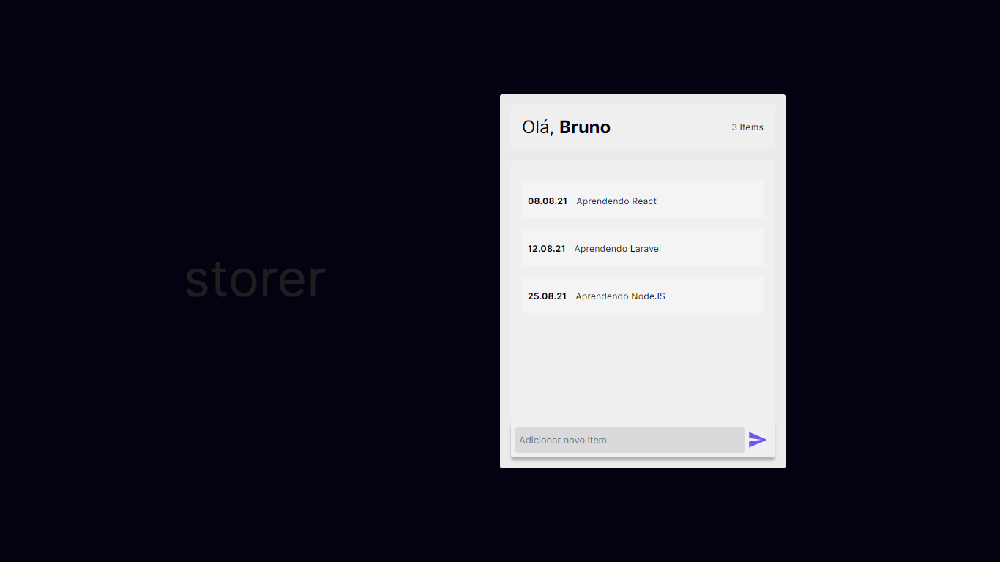

# storer
#### Adjustments and improvements

This project is still under development and will receive more features and improvements in the next versions that will focus on:

- [x] Axios global settings

# Front-end

## React dependencies

* Material UI
* Axios

# API structure

## Node dependencies

* Express
* Mongoose

## Folder structure

`/controllers` - a controller receives the incoming request, distributes to the services layer and then returns a response. The controllers are managers/supervisors.

`/middlewares` - stores more specific functions.

`/models` - stores the database models.

`/routes` - stores the routes of the API.

`/services` - a service receives the data it needs to execute a task and returns the result to the controller layer. Figures out the individual details algorithms/business logic/database calls/etc involved in completing the request.

## Routes

`/tasks`

`/tasks/{id}`

| Verb | Path        | Action | Route          |
| :--- | :---------- | :----- | :------------- |
| GET  | /tasks      | index  | photo.getAll   |
| GET  | /tasks/{id} | show   | photo.getPhoto |
| POST | /tasks      | create | photo.create   |

## Front-end print screen

